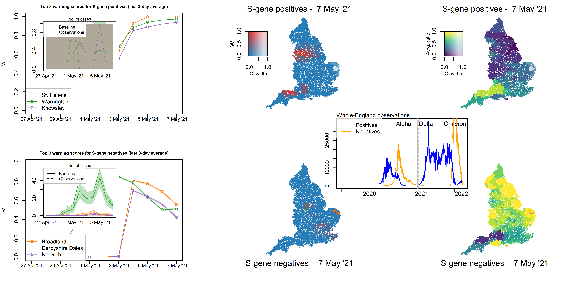

# SARS-CoV-2-spatiotemporal-surveillance

This repository contains R scripts used for the analysis presented in the paper
Massimo Cavallaro, Louise Dyson, Mike Tildesley, Dan Todkill, and Matt J. Keeling. (2023) *Spatio-temporal surveillance and early detection of SARS-CoV-2 variants of concern: a retrospective analysis*. J. R. Soc. Interface. 20: 20230410. 20230410. DOI:[https://doi.org/10.1098/rsif.2023.0410](10.1098/rsif.2023.0410). MedRxiv:[https://www.medrxiv.org/content/10.1101/2023.07.06.23292295](https://www.medrxiv.org/content/10.1101/2023.07.06.23292295).





SARS-CoV-2 data were supplied under strict data protection protocols and cannot be redisributed. Here we include synthetic data to run the scripts. Usage:
```{r}
rm(list=ls())
devtools::install_github("mcavallaro/rancovr")

# Read data
library('readxl')
source('read_data.r)

# Create baseline matrices under the null model from data
source('create_matrices.r')
# source('downsample_matrices.r') # optional

# Generate and dump on file the warning scores with `rancovr`
source('rancover_exceed.r')

# Plot
library(viridisLite)
library(sf)
source("covid_exceed_map.r")
```


